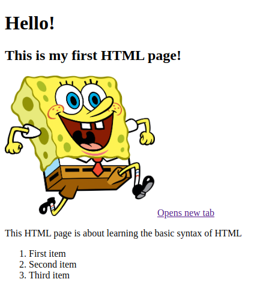

# HTML Practice

More practice with HTML, this time, you will need to recreate a page.

1. Navigate to `~/codesy/codesy-students/01-week-html-css-git/02-class-shell-git-html/03-activity-second-html` hint: use `cd` command.

2. Create a folder called `solution` hint: use `mkdir`.

3. Create a HTML webpage which is identical to this image:

4. Once you are finished, stage, commit and push the files for your solution. instructions can be found in the [repo-guidelines](../../../repo-guidelines.md).